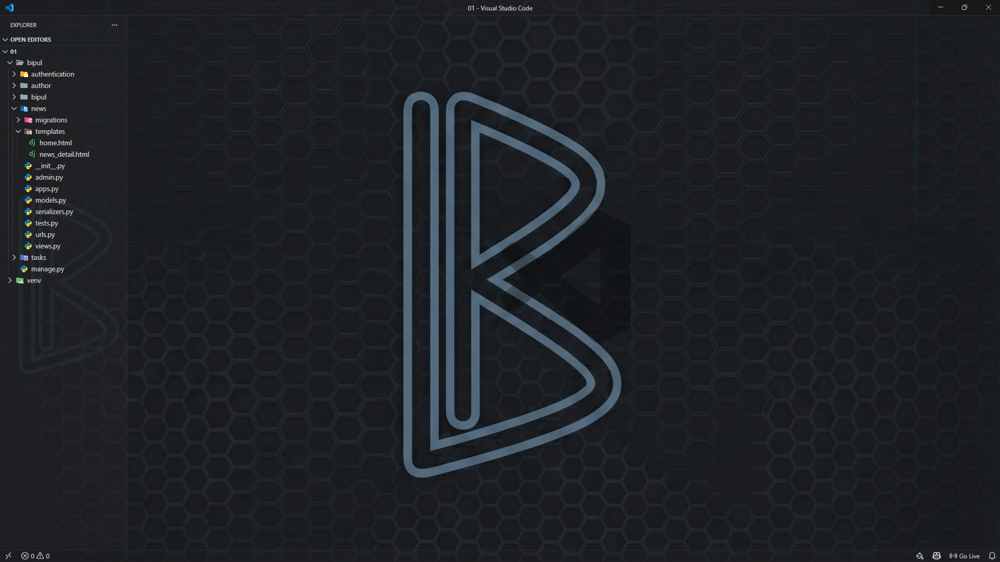

# Bipul Pro Developer VS Code Configuration

Welcome to my custom Visual Studio Code configuration! This setup is designed for a clean, professional, and distraction-free coding experience, optimized for web and software development.

It includes my personal theme, curated extensions, and custom settings, all polished for a modern and efficient workflow.


*Preview of the custom dark theme and background.*

## 🚀 Quick Installation

The easiest way to get this setup is with the one-click profile link.

<a href="https://vscode.dev/profile/github/b3344e03925f15682d05e2ce00751c18" target="_blank">
  
</a>

**Profile Link:** `https://vscode.dev/profile/github/b3344e03925f15682d05e2ce00751c18`

---

## 📚 Step-by-Step Guide

If the quick link doesn't work, or if you prefer to do it manually within VS Code, follow these simple steps:

### Prerequisite
Make sure you have [Visual Studio Code](https://code.visualstudio.com/) installed.

### Steps

1.  **Open VS Code** on your computer.
2.  Copy the profile URL:
    ```
    [https://vscode.dev/profile/github/b3344e03925f15682d05e2ce00751c18](https://vscode.dev/profile/github/b3344e03925f15682d05e2ce00751c18)
    ```
3.  In VS Code, open the **Command Palette** by pressing:
    * `Ctrl + Shift + P` (Windows/Linux)
    * `Cmd + Shift + P` (macOS)
4.  Type **"Profiles: Import Profile..."** and select it.
5.  A box will appear at the top. **Paste the URL** you copied and press **Enter**.
6.  VS Code will show a preview of the profile. Click the blue **Import Profile** button to finish.

Your VS Code will instantly update with the new theme, settings, and will begin downloading the necessary extensions.

---

## ✨ Features & Highlights

* **Professional Dark Theme:** A clean, dark aesthetic that is easy on the eyes for long coding sessions.
* **Custom Background:** Features a unique, non-distracting background with a subtle logo.
* **Curated Extensions:** Includes a set of essential extensions for Python, Django, and general web development.
* **Optimized Settings:** Fine-tuned configurations for a clutter-free editor, removing unnecessary UI elements for better focus.
* **Seamless Sync:** All keybindings, snippets, and UI state are included.

---

Enjoy your new coding environment!
